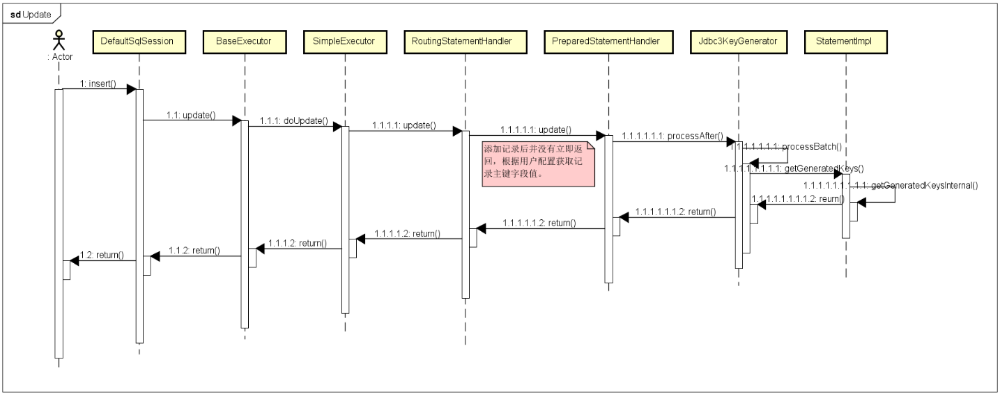

**1.使用mybatis添加数据后返回自增的主键如何操作?  其原理请画图描述?**

 

答案: 很多情况下, 我们insert一个数据, 由于主键自增 , 我们又需要返回的主键做其他的操作.  我们可以使用 <selectKey> 标签 查询返回的主键

```java
public interface UserMapper {
    //1.添加用户
    public void insertUser(User user);
}
```


xml方式

```xml
    <insert id="addUser" parameterType="com.lagou.pojo.User" >
        <!--目的:添加完用户之后,将自动增长的id返回给user对象
            selectKey : 里面可以编写查询语句,查询语句可以在下面insert语句之前或之后执行.产生一定的过.
            keyColumn : 查询数据库表的那个字段,此处指的是id
            keyProperty : java中POJO类中的那个属性
            resultType  :查询到的返回的结果类型 int
            order  : 两个sql语句的先后执行顺序,  SELECT  LAST_INSERT_ID();  INSERT INTO USER VALUES(NULL,#{username},#{birthday},#{sex},#{address});

        -->
        <selectKey keyColumn="id" keyProperty="id" resultType="java.lang.Integer"  order="AFTER">
            SELECT  LAST_INSERT_ID();
        </selectKey>

        <!--
            如果参数类型是对象类型:
            #{写的是对象的属性值}
        -->
        INSERT INTO USER VALUES(NULL,#{username},#{birthday},#{sex},#{address});
    </insert>
```

注解方式

```java
// 返回主键字段id值
@Options(useGeneratedKeys = true, keyProperty = "id", keyColumn = "id")
@Insert("INSERT INTO USER VALUES(NULL,#{username},#{birthday},#{sex},#{address});")
public interface UserMapper {
    //1.添加用户
    public void insertUser(User user);
}
```


测试:

```java
    @Test
    public void insertUserTest() {
        //4.SqlSessionFactory.openSession();  ===> sqlSession
        SqlSession sqlSession = sqlSessionFactory.openSession(true);
        UserMapper mapper = sqlSession.getMapper(UserMapper.class);
        User user = new User("志平",new Date(),"1","全真教"); 
         System.out.println("插入前: " + user);  // id为0 
        mapper.insertUser(u);
        System.out.println("插入后: " + user);  // id为1  获取自增的主键
        sqlSession.close();
    }
```


获取主键ID的实现原理

不论在xml映射器还是在接口映射器中，添加记录的主键值并非添加操作的返回值。实际上，在MyBatis中执行添加操作时只会返回当前添加的记录数。 

```java
package org.apache.ibatis.executor.statement;
public class PreparedStatementHandler extends BaseStatementHandler {
	@Override
    public int update(Statement statement) throws SQLException {
        PreparedStatement ps = (PreparedStatement) statement;
        // 真正执行添加操作的SQL语句
        ps.execute();
        int rows = ps.getUpdateCount();
        Object parameterObject = boundSql.getParameterObject();
        KeyGenerator keyGenerator = mappedStatement.getKeyGenerator();
        // 在执行添加操作完毕之后，再处理记录主键字段值
        keyGenerator.processAfter(executor, mappedStatement, ps, parameterObject);
        // 添加记录时返回的是记录数，而并非记录的主键字段值
        return rows;
    }
}
```


MyBatis添加操作的时序图 

​	


2.**MyBatis 实现一对一有几种方式?具体怎么操作的？** 

答：两种方式.  第一种使用自动映射 resultType ; 第二种使用手动映射 resultMap

举例自动映射: 

查询所有订单及订单下用户信息

```java

import java.util.Date;
@Data
public class OrderUserVo {
    //oder的所有属性
    private int id;
    private int userId;  //我们如果属性和数据库字段名称不一致可能会有问题.
    private String number;
    private Date createtime;
    private String note;
    //user的属性
    private String username;
    private Date birthday;
    private String sex;
    private String address;
}
```

```xml
 <!--方式1:查询订单及关联的用户信息-->
    <select id="findOderAndUser" resultType="orderuservo">
      SELECT
        o.id,
        o.user_id as userId,
        o.number,
        o.createtime,
        o.note,
        u.username,
        u.birthday,
        u.sex,
        u.address
        FROM
        `order` o
        LEFT JOIN `user` u
        ON o.user_id = u.id
    </select>
```

```java
   //1.查询所有订单
    @Test
    public void findOrderAndUser() {
        SqlSession sqlSession = factory.openSession();
        OrderMapper mapper = sqlSession.getMapper(OrderMapper.class);
        List<OrderUserVo> list = mapper.findOderAndUser();
        for (OrderUserVo orderUserVo : list) {
            System.out.println(orderUserVo);
        }
    }
```


举例手动映射

```java
public class Order {
    private int id;
    private int userId;  //我们如果属性和数据库字段名称不一致可能会有问题.
    private String number;
    private Date createtime;
    private String note;
    private User user;

    public Order() {
    }
```

```java
  //查询所有订单信息及关联的用户信息
    public List<Order> findOderAndUser02();
```

```xml
 <!--方式2:查询订单及关联的用户信息
        autoMapping true; 如果普通字段的sql的查询字段和 pojo的属性一致,就可以省略,自动映射
    -->
    <resultMap id="orderUserResultMap" type="order" autoMapping="true">
        <!--对主键进行映射  id-->
        <id column="id" property="id"/>
        <!--对其他字段进行映射  result-->
        <result column="user_id" property="userId"/>

        <!--关于order中的user属性的一个映射配置
            association 用来对对象的属性进行关联映射
            property 代表order类中的对象属性名 user
            javaType 代表order类中的user属性的类型
        -->
        <association property="user"  javaType="user" autoMapping="true">
            <!--将查询的字段映射到oder类中的user中的属性中去-->
            <id column="user_id" property="id"/>
        </association>
    </resultMap>
    
    <select id="findOderAndUser02" resultMap="orderUserResultMap">
        SELECT
        o.id,
        o.user_id,
        o.number,
        o.createtime,
        o.note,
        u.username,
        u.birthday,
        u.sex,
        u.address
        FROM
        `order` o
        LEFT JOIN `user` u
        ON o.user_id = u.id
    </select>
```


两种自动映射我们封装数据到一个Vo对象中直接使用resultType 指定vo对象即可, 如果是手动映射我们要建立pojo之间的包含关系,让后使用resultMap手动指定映射关系.